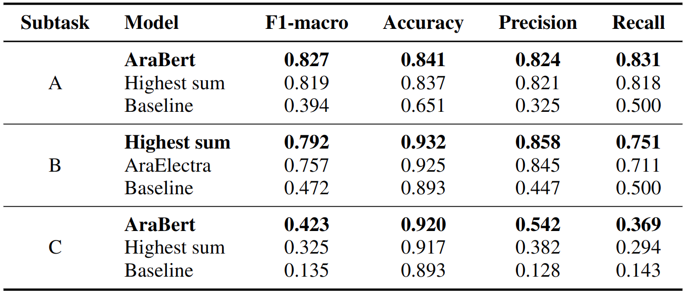

# UPV at the Arabic Hate Speech 2022 Shared Task: Offensive Language and Hate Speech Detection using Transformers and Ensemble Models




# Description
This repository contains the code for the paper **UPV at the Arabic Hate Speech 2022 Shared Task: Offensive Language and Hate Speech Detection using Transformers and Ensemble Models**. This paper was published at the LREC-WS-OSACT 2022 <!-- [LREC-WS-OSACT 2022](proceeding link -->
([The 5th Workshop on Open-Source Arabic Corpora and Processing Tools with Shared Tasks on Quran QA and Fine-Grained Hate Speech Detection](https://osact-lrec.github.io/) at [13th Edition of The Language Resources and Evaluation Conference](https://lrec2022.lrec-conf.org/en/)) scientific event. Descriptions of the implementation and the dataset are contained in the [paper](http://www.lrec-conf.org/proceedings/lrec2022/workshops/OSACT/pdf/2022.osact-1.23.pdf).

# Paper Abstract
This paper describes our participation in the shared task Fine-Grained Hate Speech Detection on Arabic Twitter at the 5th Workshop on Open-Source Arabic Corpora and Processing Tools (OSACT). The shared task is divided into three detection subtasks: (i) Detect whether a tweet is offensive or not; (ii) Detect whether a tweet contains hate speech or not; and (iii) Detect the fine-grained type of hate speech (race, religion, ideology, disability, social class, and gender).
It is an effort toward the goal of mitigating the spread of offensive language and hate speech in Arabic-written content on social media platforms. To solve the three subtasks, we employed six different transformer versions: AraBert, AraElectra, Albert-Arabic, AraGPT2, mBert, and XLM-Roberta. We experimented with models based on encoder and decoder blocks and models exclusively trained on Arabic and also on several languages. Likewise, we applied two ensemble methods: Majority vote and Highest sum. Our approach outperformed the official baseline in all the subtasks, not only considering  F1-macro results but also accuracy, recall, and precision. The results suggest that the Highest sum is an excellent approach to encompassing transformer output to create an ensemble since this method offered at least top-two F1-macro values across all the experiments performed on development and test data.  


# Cite
If you find this article <!-- [article](proceedining link) --> or the [code](https://github.com/AngelFelipeMP/Transformers-for-Arabic-hate-speech-and-offensive-language) useful in your research, please cite us as:


```
@InProceedings{magnossodepaula-EtAl:2022:OSACT,
  author    = {Magnossão de Paula, Angel Felipe  and  Rosso, Paolo  and  Bensalem, Imene  and  Zaghouani, Wajdi},
  title     = {UPV at the Arabic Hate Speech 2022 Shared Task: Offensive Language and Hate Speech Detection using Transformers and Ensemble Models},
  booktitle      = {Proceedinsg of the 5th Workshop on Open-Source Arabic Corpora and Processing Tools with Shared Tasks on Qur'an QA and Fine-Grained Hate Speech Detection},
  month          = {June},
  year           = {2022},
  address        = {Marseille, France},
  publisher      = {European Language Resources Association},
  pages     = {181--185},
  abstract  = {This paper describes our participation in the shared task Fine-Grained Hate Speech Detection on Arabic Twitter at the 5th Workshop on Open-Source Arabic Corpora and Processing Tools (OSACT). The shared task is divided into three detection subtasks: (i) Detect whether a tweet is offensive or not; (ii) Detect whether a tweet contains hate speech or not; and (iii) Detect the fine-grained type of hate speech (race, religion, ideology, disability, social class, and gender). It is an effort toward the goal of mitigating the spread of offensive language and hate speech in Arabic-written content on social media platforms. To solve the three subtasks, we employed six different transformer versions: AraBert, AraElectra, Albert-Arabic, AraGPT2, mBert, and XLM-Roberta. We experimented with models based on encoder and decoder blocks and models exclusively trained on Arabic and also on several languages. Likewise, we applied two ensemble methods: Majority vote and Highest sum. Our approach outperformed the official baseline in all the subtasks, not only considering F1-macro results but also accuracy, recall, and precision. The results suggest that the Highest sum is an excellent approach to encompassing transformer output to create an ensemble since this method offered at least top-two F1-macro values across all the experiments performed on development and test data.},
  url       = {https://aclanthology.org/2022.osact-1.23}
}
```
<!--
```

```
 -->

# Credits
OSACT 2022 shared Task Organizers

OSACT 2022 proceedings: (link coming soon)

Task website: https://sites.google.com/view/arabichate2022/home

Contact: hmubarak@hbku.edu.qa

